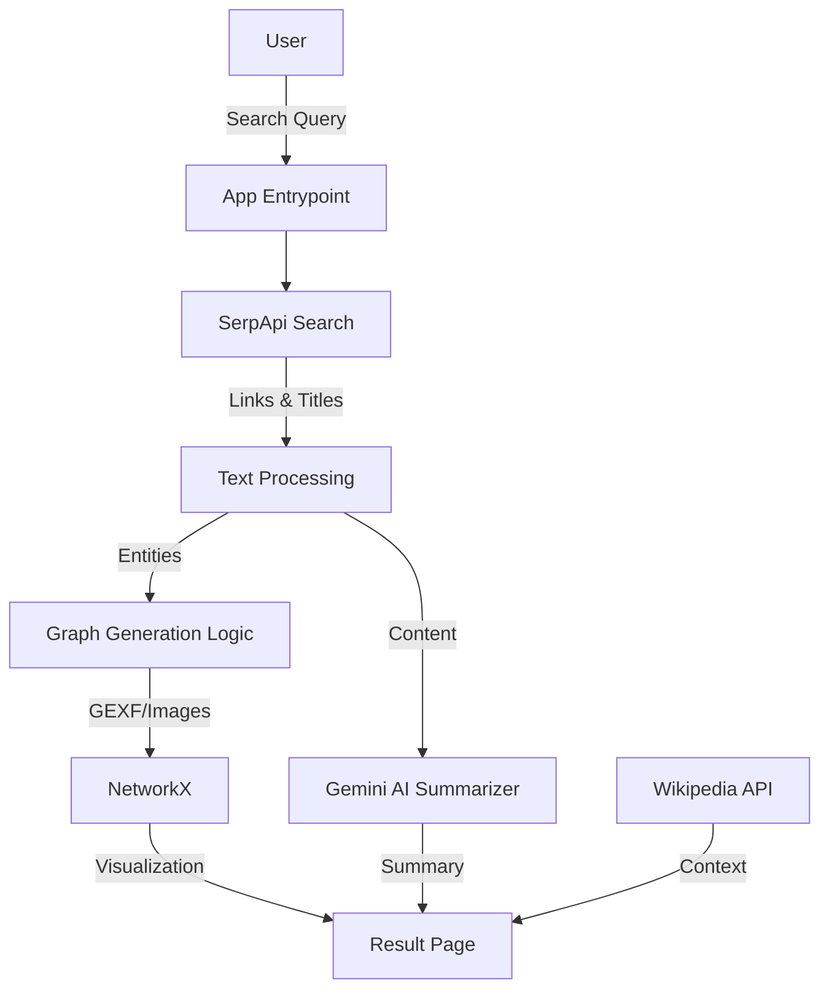

# Graph-Net: Knowledge Graph & Summarization Tool

Graph-Net is a powerful web application that visualizes the relationships between concepts using interactive Knowledge Graphs and provides comprehensive summaries using Google's Gemini AI. It leverages search results to dynamically generate insights, making it an excellent tool for research and learning.

## Features

- **Interactive Knowledge Graphs**: Visualizes connections between search terms and related concepts using NetworkX and D3.js (via generated images).
- **AI-Powered Summarization**: Generates concise, structured summaries of topics using Google Gemini 1.5 Pro.
- **Real-time Search Integration**: Fetches live data from the web using SerpApi/Google Search.
- **Wikipedia Integration**: Retrieves quick context from Wikipedia for the searched query.
- **Django-Powered**: Robust backend built with Django 5.

## Tech Stack

- **Backend Framework**: Django 5.1.7
- **AI & NLP**: Google Gemini AI (`google-generativeai`), Spacy (`en_core_web_sm`)
- **Graph Processing**: NetworkX, Matplotlib
- **Web Crawling**: SerpApi, BeautifulSoup4, Requests
- **Database**: SQLite (Default Django DB)

## Architecture



## Installation

### Prerequisites
- Python 3.10+
- Google Gemini API Key
- SerpApi API Key

### Steps

1. **Clone the Repository**
   ```bash
   git clone <repository_url>
   cd Graph-Net/projectIRT
   ```

2. **Install Dependencies**
   ```bash
   pip install -r Requirements.txt
   ```
   *Note: You might need to download the Spacy language model separately if not installed automatically:*
   ```bash
   python -m spacy download en_core_web_sm
   ```

3. **Environment Setup**
   Create a `.env` file in the `projectIRT` directory or set environment variables directly:
   ```env
   GEMINI_API_KEY=your_gemini_api_key
   # Add other keys if configured in settings
   ```
   *Note: The current codebase might have hardcoded keys in `summarizer.py` and `Crawler_final.py`. It is highly recommended to replace them with environment variables for security.*

4. **Database Migration**
   ```bash
   python manage.py migrate
   ```

5. **Run the Server**
   ```bash
   python manage.py runserver
   ```

## Usage

1. Open your browser and navigate to `http://127.0.0.1:8000/`.
2. Enter a topic in the search bar (e.g., "Machine Learning", "Python").
3. View the generated **Knowledge Graph** visualizing related concepts.
4. Read the **AI-generated summary** and **Wikipedia context**.
5. Explore the list of **Source Links** used for fetching information.

## Project Structure

- `projectIRT/`: Main Django project configuration.
- `entrypoint/`: Core app handling views and URL routing.
- `summarizer.py`: Logic for interfacing with Gemini AI.
- `make_graph.py`: Scripts for generating network graphs.
- `Crawler_final.py`: SerpApi integration for fetching search results.
- `loluwu.py`: Helper scripts for data processing and cleaning.
